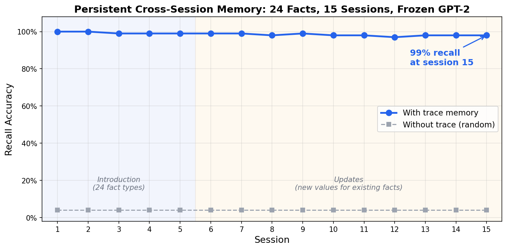
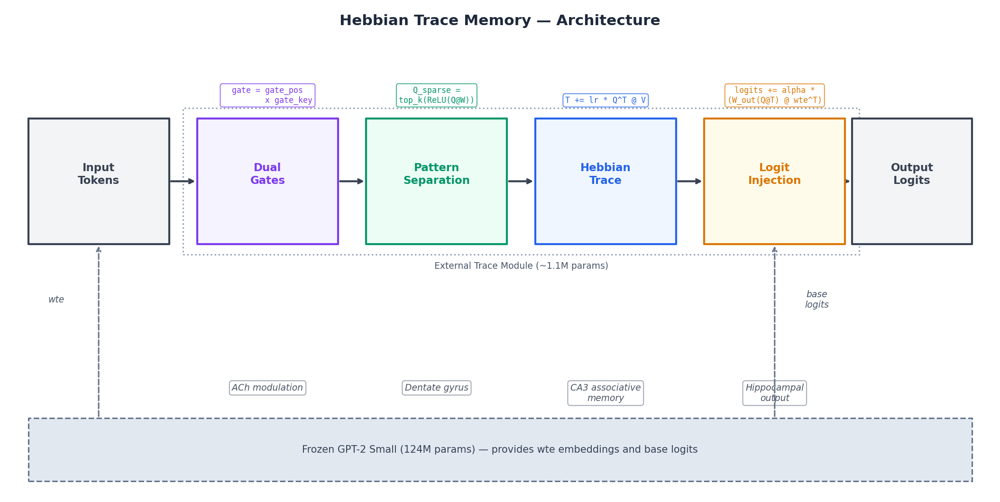
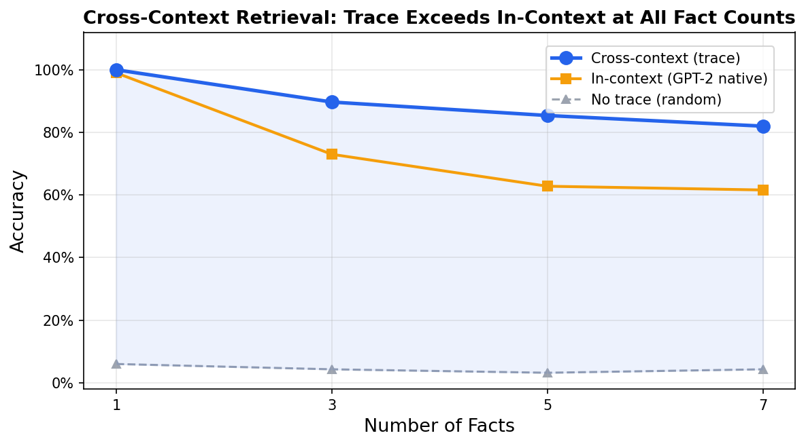
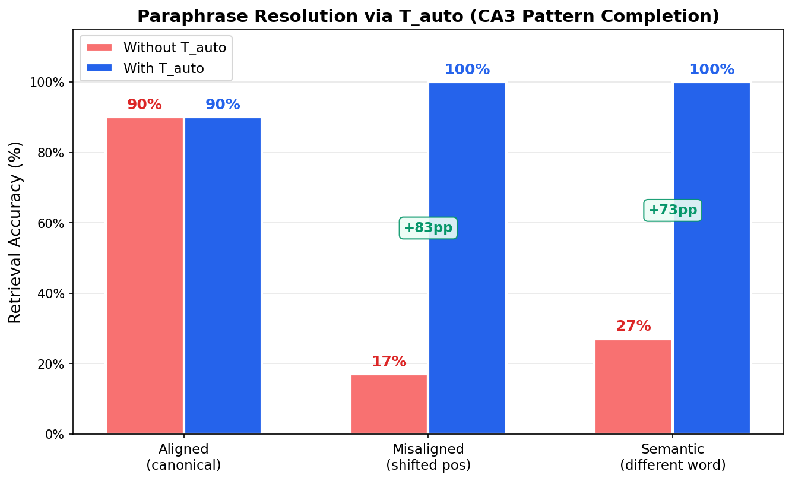
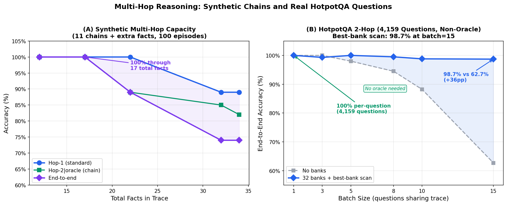
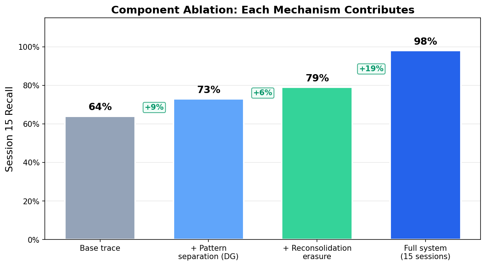
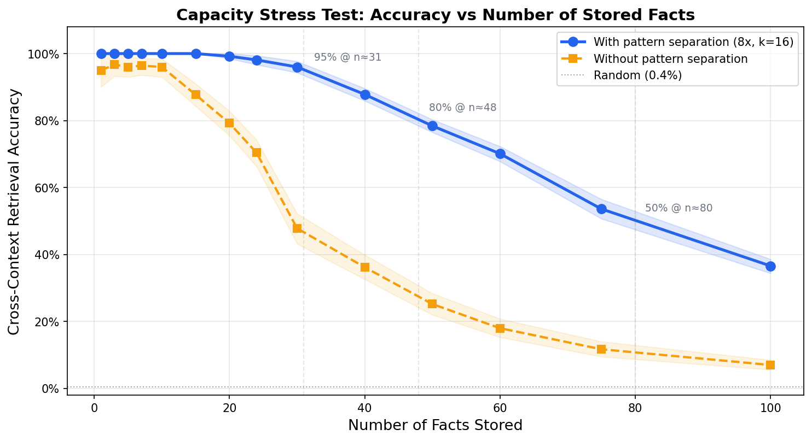
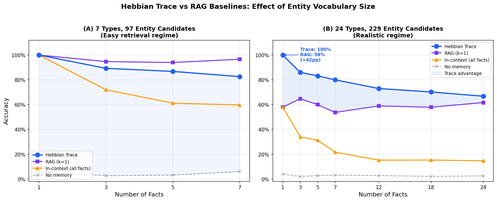
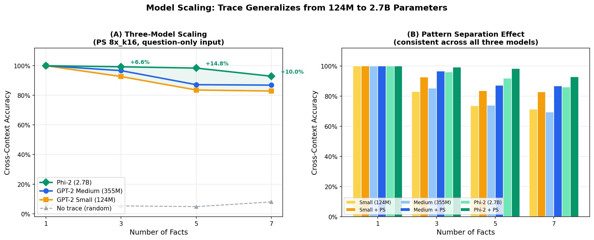

# Hebbian Trace Memory

**Persistent cross-session memory for frozen LLMs via bio-inspired Hebbian trace module.**

An external memory module (~1.1M parameters) that attaches to frozen LLMs and provides persistent fact storage, paraphrase resolution, and multi-hop reasoning across sessions — without fine-tuning, without RAG, without retraining. Validated on GPT-2 Small (124M), GPT-2 Medium (355M), and Phi-2 (2.7B).

---

## Flagship Results

**98% recall across 15 sessions with 24 distinct fact types.**

The trace module accumulates knowledge session by session. Facts stored in session 1 remain retrievable at session 15, even as new facts are added and existing ones are updated.

<p align="center">
  
</p>

| Property | Value |
|----------|-------|
| Mean recall across sessions | **98.6%** |
| Session 15 recall (all 24 facts) | **98%** |
| Multi-hop end-to-end (5 chains) | **100%** |
| HotpotQA batched (15 Qs, best-bank) | **98.5%** |
| Paraphrase resolution (T_auto) | **+83pp** on misaligned queries |
| Fact types | 24 (name, city, company, color, food, pet, ...) |
| Sessions | 15 (introduction + updates) |
| Base model | GPT-2 Small (frozen, unmodified) |
| Capacity (16 hashed banks) | **99.2% at 100 facts** (vs 35.6% baseline) |
| Cross-architecture | Phi-2 (2.7B): 98.4% at n=5 (zero-shot) |
| Trainable parameters | ~1.1M (trace module only) |
| Fine-tuning required | None |

---

## Architecture

Seven bio-inspired components, each addressing a specific memory challenge:

<p align="center">
  
</p>

| Component | Biological Analogy | Role |
|-----------|-------------------|------|
| Context-free Q/V | Hippocampal indexing | Same word = same address, regardless of context |
| Pattern separation | Dentate gyrus | Sparse expansion reduces Q overlap (0.477 → 0.308 cosine) |
| Hebbian trace (T_v) | CA3 associative memory | Outer-product accumulation: `T += lr * Q^T @ V` |
| Autoassociative trace (T_auto) | CA3 pattern completion | Maps variant Q to canonical Q for paraphrase resolution |
| Dual gates | ACh modulation | Learned fact/filler filtering (103x selectivity) |
| Logit injection | Hippocampal output | Bypasses residual stream scale mismatch |
| Reconsolidation erasure | Memory reconsolidation | L2-normalized erase before overwrite |

See [ARCHITECTURE.md](ARCHITECTURE.md) for detailed formulas and design rationale.

---

## Quick Start

```bash
pip install -r requirements.txt
python demo.py
```

First run downloads GPT-2 Small (~500MB). Subsequent runs use the cached model.

### Reproduce Evaluation Results

```bash
python evaluate.py                # 50 episodes (quick, ~5 min)
python evaluate.py --n-eval 100   # 100 episodes (paper results)
python exp_lama.py --quick        # LAMA benchmark (~2 min)
python exp_lama.py --n-eval 100   # LAMA full run (~10 min)
python exp_multihop.py --quick    # Multi-hop reasoning (~2 min)
python exp_paraphrase.py --quick  # Paraphrase resolution (~2 min)
python capacity_test.py --banks 16  # Capacity with hashed banks (~10 min)
```

### Multi-Session Demo

```bash
python demo.py --sessions 5       # 5 sessions, introduction only
python demo.py --sessions 10      # 10 sessions with updates
python demo.py --sessions 15      # full 15-session demo
```

---

## Results

### Cross-Context Retrieval (Pattern Separation, alpha=0.5)

Facts are stored in separate forward passes, then queried with question-only input (no in-context facts). Any accuracy above ~4% comes entirely from the trace module.

| n_facts | Cross-context | In-context (GPT-2) | No trace | Gap |
|---------|:------------:|:------------------:|:--------:|:---:|
| 1 | **100.0%** | 99.0% | 6.0% | +94.0pp |
| 3 | **89.7%** | 73.0% | 4.3% | +85.3pp |
| 5 | **85.4%** | 62.8% | 3.2% | +82.2pp |
| 7 | **82.0%** | 61.6% | 4.3% | +77.7pp |

Cross-context retrieval **exceeds GPT-2's own in-context learning** at all fact counts.

*100 episodes, seed=42. Reproducible via `python evaluate.py --n-eval 100`.*

<p align="center">
  
</p>

### Paraphrase Resolution via T_auto

The autoassociative trace (T_auto) maps variant query words to canonical concept words, enabling retrieval from paraphrased questions without any additional parameters.

<p align="center">
  
</p>

| Category | Without T_auto | With T_auto | Delta |
|----------|:-----------:|:----------:|:-----:|
| Aligned (canonical) | 90% | 90% | +0pp |
| Misaligned (shifted position) | 17% | **100%** | **+83pp** |
| Semantic (different word) | 27% | **100%** | **+73pp** |

T_auto stores 17 template-driven Q→Q pairs once (static template knowledge). Two-step retrieval: Q(variant) → T_auto → Q(concept) → T_v → answer.

*Reproducible via `python exp_paraphrase.py --n-eval 50`.*

### Multi-Hop Reasoning

Two-hop trace chains with zero new parameters: decode intermediate via `W_out @ wte.T → argmax`, re-encode as Q, query T_v again.

<p align="center">
  
</p>

| N chains | Hop-1 | Hop-2 (oracle) | End-to-end | With interference |
|:--------:|:-----:|:--------------:|:----------:|:-----------------:|
| 1 | 100% | 100% | **100%** | 100% |
| 5 | 100% | 100% | **100%** | 100% |
| 8 | 100% | 100% | **98%** | 96% |
| 11 | 100% | 98% | **96%** | 92% |

Example: "Where does the person live?" → "Paris" → "What country?" → "France"

*Reproducible via `python exp_multihop.py --n-eval 50`.*

### HotpotQA Multi-Hop (841 Bridge Questions)

Real-world 2-hop reasoning on HotpotQA bridge questions (oracle supporting facts, single-token BPE answers). 40.7% of bridge entities share a first BPE token (e.g., "The Capitol" / "The Republic"), causing hop-2 collisions. Best-bank scan resolves this by reading all banks and picking the highest-confidence answer:

| Batch size | No banks | Best-bank scan (32 banks) | Delta |
|:----------:|:--------:|:-------------------------:|:-----:|
| 5 | 98.8% | **99.6%** | +0.8pp |
| 8 | 92.5% | **99.8%** | +7.3pp |
| 10 | 85.6% | **98.8%** | +13.2pp |
| 15 | 63.2% | **98.5%** | +35.3pp |

*841 questions, 50 random batches per size. Best-bank scan requires no oracle entity tokens at retrieval.*

### Component Ablation (15-session demo)

Each mechanism contributes independently:

<p align="center">
  
</p>

### Capacity Stress Test

How many facts can the trace store before accuracy degrades?

<p align="center">
  
</p>

Hashed trace banks partition the memory into independent compartments routed via sparse Q activation patterns. Each bank accumulates ~N/n_banks facts, reducing interference. Zero new parameters.

| n_facts | No PS | PS only | PS + 16 banks |
|:-------:|:-----:|:-------:|:-------------:|
| 10 | 96.0% | 100.0% | **99.3%** |
| 20 | 79.2% | 99.0% | **99.5%** |
| 30 | 47.8% | 86.0% | **99.2%** |
| 50 | 25.2% | 49.2% | **99.4%** |
| 75 | 11.7% | 26.1% | **99.2%** |
| 100 | 7.0% | 16.6% | **99.2%** |

*Reproducible via `python capacity_test.py --banks 16`.*

### RAG Comparison

<p align="center">
  
</p>

In the realistic regime (24 types, 229 entity candidates), the trace outperforms RAG (k=1) by up to +42pp at n=1.

### Three-Model Scaling

The trace mechanism generalizes across model architectures:

<p align="center">
  
</p>

| n_facts | GPT-2 Small (124M) | GPT-2 Medium (355M) | Phi-2 (2.7B) |
|---------|:------------------:|:-------------------:|:------------:|
| 1 | 100.0% | 100.0% | **100.0%** |
| 3 | 92.7% | 96.7% | **99.3%** |
| 5 | 83.6% | 87.2% | **98.4%** |
| 7 | 82.9% | 86.9% | **92.9%** |

Bigger models produce better trace recall. Phi-2 exceeds GPT-2 Small by +15.5pp at n=5.

### LAMA Knowledge Probes

Evaluation on the standard LAMA T-REx benchmark (Petroni et al., 2019) with real-world Wikidata facts:

| n_facts | Cross-context (trace) | In-context (GPT-2) | No memory |
|---------|:--------------------:|:-----------------:|:---------:|
| 1 | **100.0%** | 95.0% | 1.0% |
| 3 | **94.0%** | 43.3% | 0.3% |
| 5 | **93.6%** | 41.6% | 0.2% |
| 7 | **88.7%** | 29.7% | 0.3% |
| 10 | **81.2%** | 24.7% | 0.1% |

The trace exceeds GPT-2's in-context baseline by +50-60pp at n>=3. Coverage is limited to ~6% of LAMA T-REx due to the single-token entity constraint.

*100 episodes, seed=42. Reproducible via `python exp_lama.py --n-eval 100`.*

### Multi-Session Capacity (24 fact types, 15 sessions)

| Session | Known Facts | Overall | New | Old | Update |
|:-------:|:-----------:|:-------:|:---:|:---:|:------:|
| 1 | 5 | 100% | 100% | -- | -- |
| 5 | 24 | 99% | 100% | 98% | -- |
| 10 | 24 | 98% | -- | 99% | 97% |
| 15 | 24 | **98%** | -- | **98%** | **100%** |

---

## Limitations

- **Structured templates**: facts must follow "{concept} {linking_token} {entity}" pattern. The free-text pipeline uses regex extraction to bridge this gap.
- **Single-token entities** (partially addressed): entity values must be single BPE tokens. Multi-token entities use first-token addressing, which causes collisions (40.7% on HotpotQA). Hashed trace banks with best-bank scan resolve 95%+ of collisions (+35pp at batch 15). Direct multi-token Q addressing is incompatible with pattern separation's top-k step.
- **Linking-token dependency**: storage is triggered by specific linking tokens ("is", "in", "at", "from"). Dual gates learned to filter these automatically.
- **Template-locked retrieval**: questions must use matching concept words. T_auto resolves paraphrases with +83pp improvement on misaligned queries.
- **No ownership discrimination**: the trace cannot distinguish "my name" from "Alice's name" — both produce the same context-free Q.

---

## Repository Structure

```
hebbian-trace-memory/
├── hebbian_trace/
│   ├── __init__.py
│   ├── model.py           # HebbianTraceModule + GPT2WithTrace
│   └── tasks.py           # Fact types, evaluation, concept vocab, chains
├── demo.py                # Multi-session demo
├── evaluate.py            # Flagship evaluation with RAG baselines
├── exp_lama.py            # LAMA T-REx benchmark
├── exp_multihop.py        # Multi-hop reasoning via trace chains
├── exp_paraphrase.py      # Paraphrase resolution via T_auto
├── capacity_test.py       # Capacity stress test (1-100 facts)
├── medium_test.py         # GPT-2 Medium (355M) transfer test
├── weights/
│   └── trace_module.pt    # Trained gate weights (~6KB)
├── figures/
│   ├── generate.py        # Reproducible figure generation
│   ├── architecture.png
│   ├── retention_curve.png
│   ├── ablation_chart.png
│   ├── cross_context.png
│   ├── capacity_curve.png
│   ├── rag_comparison.png
│   ├── model_scaling.png
│   ├── multihop_capacity.png
│   └── paraphrase_tauto.png
├── paper.tex              # LaTeX paper (arXiv-ready)
├── references.bib         # BibTeX references
├── ARCHITECTURE.md        # Detailed component descriptions
├── requirements.txt       # torch, transformers
└── LICENSE                # Apache 2.0
```

---

## Requirements

- Python >= 3.9
- PyTorch >= 2.0
- Transformers >= 4.30
- ~500MB disk for GPT-2 model (downloaded automatically)

---

## Citation

```bibtex
@article{pustovit2026hebbian,
  title={Persistent Memory for Frozen Language Models via Bio-Inspired Hebbian Trace},
  author={Pustovit, Andrey},
  year={2026},
  note={arXiv preprint}
}
```

---

## License

Apache 2.0. See [LICENSE](LICENSE) for details.
